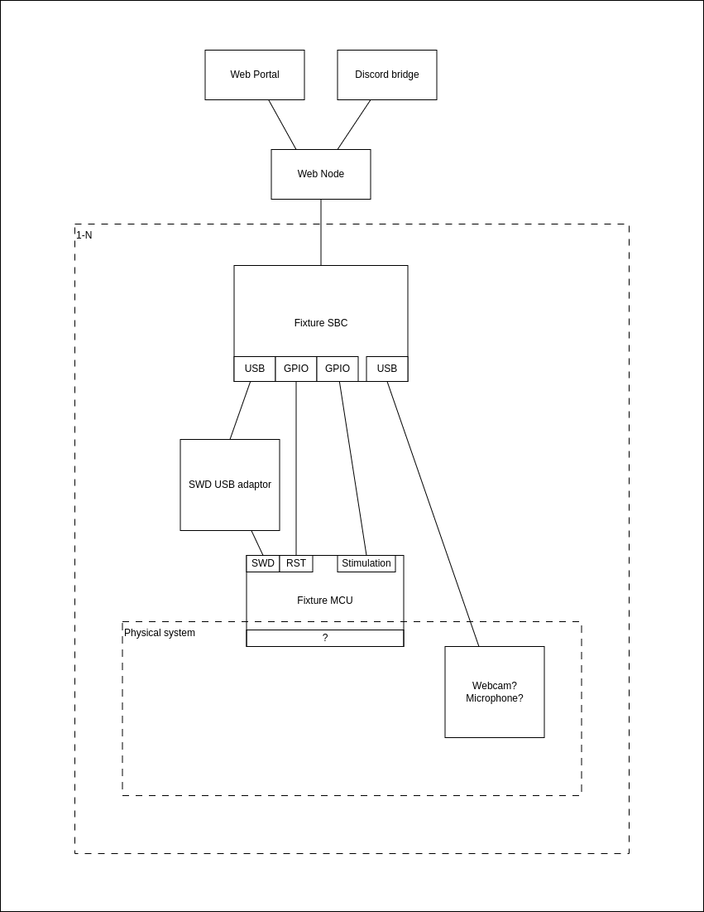

# Remote Tooling for Embedded Systems

## Core Problem
Embedded systems education and development often face barriers due to the necessity of physical hardware, limiting opportunities for remote interaction and experimentation. This project seeks to break down those barriers by creating a secure platform that allows users to remotely run and test their embedded solutions on real hardware. Our aim is to spark curiosity and nurture the innate desire to explore, enabling users to witness the dynamic interplay between their code and the physical world. By providing meaningful, sensory-rich feedback, we invite users to embrace the excitement of bringing ideas to life.

Moreover, we aim to make it quick and easy for anyone to set up their own system, fostering a collaborative environment where more people can create challenges and contribute to a shared "garden" of embedded problems. This will empower communities to cultivate diverse learning experiences and expand opportunities for exploration and innovation.

## Purpose and Target Audience
The platform is primarily designed for embedded systems enthusiasts and students, offering them the opportunity to test their code remotely and experience the real-world impact of their solutions. While focused on educational use and fostering curiosity, we hope the platform may also extend its utility to professional embedded systems development. At its core, this project functions as a hardware-in-the-loop test fixture presented in an open/accessible format, enabling users to interact with systems they don't own and witness the tangible results of their work.

## User Workflow
1. **Submission**: Users upload their binary images via a web portal or a community-integrated platform (e.g., Discord).
2. **Execution**: The system runs the user-submitted code on a connected microcontroller. The process is managed by a daemon on an SBC (e.g., Raspberry Pi), which handles flashing, execution, and collecting outputs.
3. **Feedback**: Users receive a report detailing the performance of their solution and context-specific outputs (e.g., video, audio). Additionally, a live stream may be provided to allow the community to observe the testing process.

## Technical Setup
- **Initial Hardware**: Raspberry Pi (or similar Linux SBC) connected to microcontrollers (e.g., basic STM32 parts, RP2040).
- **Communication**: The SBC interacts with the MCU via GPIO, USB for JTAG/SWD, or other interfaces as needed.
- **Architecture**: A cloud-based web service queues user jobs, and SBCs fetch tasks and upload results. This architecture isolates SBCs from direct internet access, enhancing security.

## Initial Test Fixtures
1. **Flash that LED**: Users must create code to flash an LED at specific intervals.
2. **Balance**: An inverted pendulum on a linear rail, where users must stabilise the pendulum in an inverted position.
3. **BeepBoop**: Users process audio input from a microphone and flash different LEDs based on sound detection ("Beep" and "Boop" signals).

## Security and Abuse Mitigation
- **System Design**: The setup ensures security by limiting user interaction to the MCU level, preventing direct SBC or fixture compromise.
- **Fixture Safety**: Physical test fixtures will be designed to be damage-resistant, and MCUs selected will not be vulnerable to bricking through configuration bits.
- **Reset Mechanism**: Fixtures will be equipped with mechanisms (e.g., SWD and reset lines) to fully erase and reset the MCU between runs.
- **User Moderation**: Users will be part of known communities and can be moderated manually if needed.

## Future Plans
- **Scalability**: The platform is designed to support dozens of test setups and potentially thousands of users.
- **Extensions**: Over time, additional fixtures and problem types can be introduced, expanding the range of embedded challenges available.

## Vision
The "Remote Thing for Embedded Stuff" project aims to open up access to embedded systems testing by enabling remote execution and feedback, fostering a global community of learners and enthusiasts to push their limits in embedded development.
